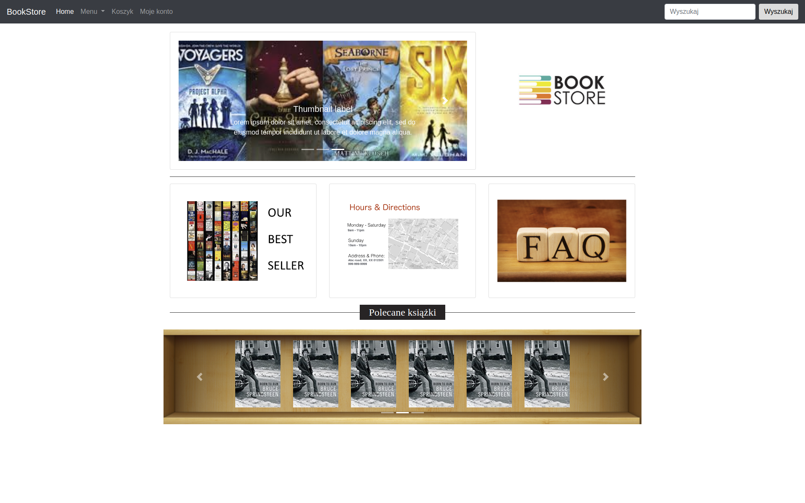
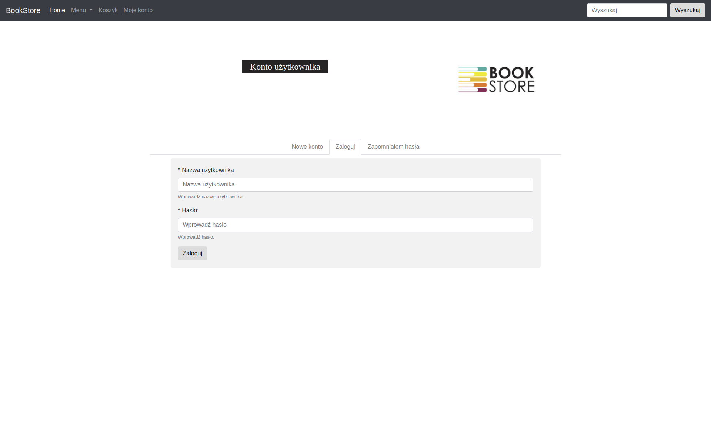

# Bookshop

## Application description:
Application consist both of administration panel and front-end Web-app. It was created using almost all technologies contained in the curriculum of Coders Lab course (with the main focus on  Spring and Hibernate frameworks).

## How to run application:
1.Import project to your IDE (I've used Eclipse building this project).
2. Prepare mySQL database - set up a new database called 'bookstore'.

Run application in your web browser - use address: http://localhost:8080/ 
Then application should work.

## Functionality

1.User functionality:
- registering new users,
- user can register after clicking on confirmation link send by email
- user can reset password and edit her/his profile data,
- user will be able to search and browse books

2:Admin functionality:
- adding, editing and deleting books

3.Shopping cart fuctionality:
- adding products to cart
- editing amount of elements in the cart
- after submitting order - confirmation email will be sent to the customer

## Technologies used
- Java 8
- Spring (Framework, Boot, Data, Security)
- JPA(Hibernate)
- mySQL
- Thymeleaf
- Bootstrap

## Things to improve
- developing admin functionality
- developing cart functionality

## Sample images

